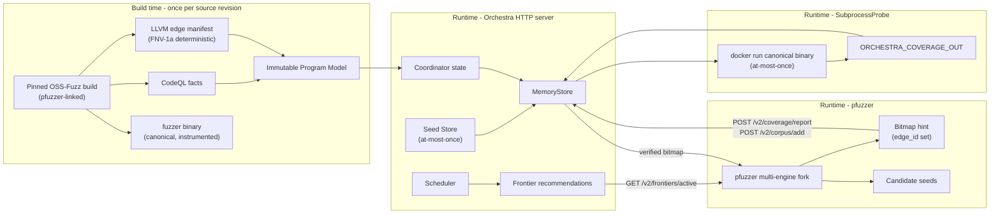

# Orchestra V2 design

## 1. Decision summary

Orchestra V2 is a side-by-side rewrite, not an in-place replacement of V1.
V1 remains the experiment-reproduction baseline. V2 may reuse process and
corpus-management experience through adapters, but its core data flow is new:

```text
pinned OSS-Fuzz build
  -> build-time CodeQL facts + LLVM runtime edge manifest
  -> prebuilt pfuzzer libFuzzer.a links into every fuzzer binary
  -> immutable Program Model
  -> one-time canonical replay of unseen seeds
  -> cached coverage bitmaps (at-most-once)
  -> incremental Coordinator state
  -> later Region/seed/fuzzer decisions (Orchestra recommends; pfuzzer executes)
```

The first go/no-go question is whether this measurement chain is reliable:

```text
CodeQL guard
  -> LLVM true/false runtime edge IDs
  -> canonical seed bitmap (via SubprocessProbe; pfuzzer-reported bitmap is hint only)
  -> Active Frontier transition
  -> Coordinator state (verified bitmap union only)
```

**Process boundary**: V2 is a passive HTTP analyzer. pfuzzer drives multi-engine
fuzzing execution and corpus management; Orchestra serves analysis results via
HTTP/JSON on `/v2/*`. `pfuzzer/FuzzerOrchestra.cpp` is the HTTP client.

**Trust boundary**: pfuzzer-reported bitmaps are hints. `SubprocessProbe.Measure()`
runs the canonical binary once per `(model_id, seed_hash)` (at-most-once via
`MemoryStore`) and supplies the authoritative `EdgeSet`. All frontier state,
bitmap union, and scheduler decisions use verified bitmaps only.

Region construction and scheduling policy must wait until this chain passes
the gates in `ROADMAP.md`.

## 2. Why V2 exists

### 2.1 Static analysis in V1 is expensive but underused

V1 primarily consumes Fuzz Introspector as a call-tree source. Much of its
richer output does not affect decisions, while enumerating root-to-leaf call
paths becomes expensive and gives Region an imprecise meaning on large targets.

### 2.2 Tree-sitter cannot support semantic claims

Tree-sitter is useful for syntax but cannot reliably determine:

- whether a predicate depends on fuzz input;
- whether a value came through a macro, enum, alias, or another function;
- the possible targets of indirect and virtual calls;
- which downstream blocks a guard controls;
- how a source predicate maps to a runtime branch.

V2 uses CodeQL facts extracted from the real build for source-level semantics.
It does not treat CodeQL as a runtime coverage system.

### 2.3 V1 online cost grows with historical corpus size

Replaying the entire corpus and rebuilding `llvm-cov` reports after each job
makes analysis cost grow with all seeds ever retained. V2 hashes and measures
only globally unseen seeds, caches their canonical coverage, and computes
unions and differences from bitmaps. Its incremental cost depends only on the
number of new edges per seed, not on corpus size.

### 2.4 V1's two performance pathologies made it unusable on real targets

**Pathology 1 — libFuzzer merge is O(N²)**: V1 ran libFuzzer in `-merge=1` mode to
derive a "unique coverage set", then waited for the merge before any analysis.
On a corpus of N seeds, merge is pairwise comparison — O(N²). On the 21 OSS-Fuzz
targets (the largest being openssl/x509 with ~1.3M edges), this blocked all
online policy decisions.

**V2's fix**: V2 never produces a unique coverage set. Each seed is measured
once via `SubprocessProbe` and its edge bitmap is unioned with the global set.
Bitmap union is O(K) where K is the number of new edges per seed, regardless of
corpus size N. The "row coverage" metric is dropped from the scheduler path.

**Pathology 2 — tree-sitter `if` lookups are O(N) per query**: V1's
`internal/analysis/` re-parsed the C/C++ AST for every seed (every `if`
enumeration was O(N) in AST node count). On a 170K-line zlib, a single
frontier-match query took milliseconds.

**V2's fix**: V2 extracts all source predicates, calls, and control
dependencies at build time via CodeQL. Runtime frontier evaluation is
`bitmap.EdgeSet.Contains(edge_id)` — O(1) hash lookup. The `internal/analysis/`
tree-sitter path stays as V1 baseline; V2's `internal/probe`, `internal/replay`,
`internal/coordinator`, `internal/region`, `internal/scheduler` import nothing
from it.

See §5.5 for the V2 performance contract.

### 2.5 V1 was an HTTP server, then V2 collapsed, then V2 reverted

V1 ran Orchestra as an HTTP server (Go `webcore/` on port 8080) with pfuzzer
as the HTTP client (`pfuzzer/FuzzerHFC.cpp` via `httplib::Client` and
`HFC_URL`). A later V2 revision collapsed to a single in-process Go binary
that drove fuzzing directly. The current design reverts to V1's HTTP
boundary because (a) pfuzzer's multi-engine coordination is a real strength
that should not be re-implemented, (b) the trust boundary between pfuzzer and
Orchestra is easier to enforce across a process boundary, and (c) persistent
crash recovery is cleaner when Orchestra state is independent.

The new measurement chain (CodeQL → LLVM pass → Program Model → SubprocessProbe →
MemoryStore) stays intact; only the orchestration role flipped back to pfuzzer.

## 3. Goals and non-goals

### Goals

1. Build reproducible, versioned semantic and runtime facts.
2. Give coverage the same meaning across different fuzzing engines.
3. Make online analysis incremental in newly observed seeds.
4. Define frontier, Region, seed evidence, and job contribution precisely.
5. Make decisions replayable and suitable for ablation experiments.
6. Start with an interpretable scheduler only after measurement is validated.
7. Verify coverage only via the canonical binary; never trust engine-native
   bitmaps as authority.

### Non-goals

- Do not query CodeQL during fuzzing.
- Do not support every C/C++ construct or indirect call in the first slice.
- Do not claim static analysis proves a seed will enter a Region.
- Do not re-implement multi-engine coordination; pfuzzer owns it.
- Do not reproduce libFuzzer merge semantics in V2 (performance pathology).
- Do not execute tree-sitter at runtime (performance pathology).
- Do not use CodeQL database IDs as persistent or runtime identifiers.
- Do not require all engines to share a binary or object cache.
- Do not add reinforcement learning before simple measurable policies work.

## 4. Architecture



### 4.1 Build layer

Orchestra uses OSS-Fuzz as a local build backend. It reuses the pinned upstream
`project.yaml`, `Dockerfile`, `build.sh`, harness, dictionaries, and runner
contract. It does not submit Orchestra itself as an OSS-Fuzz project.

#### 4.1a Pfuzzer linkage

Every fuzzer binary built by OSS-Fuzz is linked against the prebuilt pfuzzer
`libFuzzer.a` instead of upstream libFuzzer. The substitution happens via
`LIB_FUZZING_ENGINE=/opt/pfuzzer/libFuzzer.a` in the build container (set by
`cmd/orchestra-ossfuzz build` before invoking `Planner.BuildProfile`). The
prebuilt `libFuzzer.a` is produced by `cmd/orchestra-pfuzzer-build` from
`third_party/pfuzzer/` and mounted read-only into the container at
`/opt/pfuzzer/libFuzzer.a`.

The resulting binary supports both modes:

- `./binary /seed` — single-threaded libFuzzer single-seed replay (V2
  SubprocessProbe runs binaries in this mode).
- `./binary -fork=N -fuzzers=afl,libfuzzer /corpus` — pfuzzer multi-engine
  fork coordination (runtime path, controlled by `pfuzzer/FuzzerOrchestra.cpp`).

Without `-fork/-fuzzers`, the binary is functionally equivalent to plain
libFuzzer. With them, the binary exercises pfuzzer's multi-engine scheduling.
The two modes share the same edge bitmap representation because the IR of
conditional branches is identical regardless of which `main()` is linked.

#### 4.1b Pfuzzer build location

| Path | Status |
|---|---|
| `third_party/pfuzzer/` | Pfuzzer source as git submodule (gitignored, not committed) |
| `third_party/pfuzzer/build/libFuzzer.a` | Output of `cmd/orchestra-pfuzzer-build` (gitignored) |
| `pfuzzer/FuzzerOrchestra.cpp` | New pfuzzer-side HTTP client (replaces V1 `FuzzerHFC.cpp` over `/v2/*`) |
| `pfuzzer/FuzzerHFC.cpp` | V1 client (deprecated, retained 1 release cycle) |

CodeQL must observe the actual compiler processes. Therefore the CodeQL CLI is
mounted read-only into the project builder container and wraps
`/usr/local/bin/compile` there. Wrapping host-side `infra/helper.py` cannot see
compiler processes across the container boundary.

The intended profiles are:

| Profile | Output | Frequency |
|---|---|---:|
| `semantic-canonical` | DB, canonical binary, edges | per model |
| `engine-<name>` | engine target and runner metadata | per engine family |
| `report-coverage` | source coverage binary | evaluation only |
| `debug` | symbols and diagnostics | on demand |

The scaffold implements the first two profile shapes. `report-coverage` and
`debug` remain design requirements, not current commands.

The preferred optimization is one semantic-canonical build in which CodeQL
tracing and LLVM pass injection coexist. If compiler/extractor compatibility is
not reliable, split it into automatic `semantic` and `canonical` profiles that
still use the same upstream OSS-Fuzz project definition.

### 4.2 Build-time semantic layer

The QL pack exports facts, not policy. Its eventual minimum fact set is:

- functions, linkage, location, complexity, and harness reachability;
- direct and confidence-labelled indirect calls;
- `if`, loop, conditional-expression, and `switch` guards;
- raw predicate features, types, signedness, operators, and constants;
- local and selectively computed interprocedural input dependency;
- control dependence and candidate dictionary tokens.

Queries must not construct root-to-leaf Regions or scheduler scores. The model
builder in Go performs deterministic key generation, mapping, graph work, and
schema validation.

Input dependency classes are:

- `none` -- proven independent of fuzz input;
- `local_direct` -- direct local data flow;
- `interprocedural_modeled` -- interprocedural flow through modeled code;
- `interprocedural_unmodeled` -- flow crosses an unmodeled boundary;
- `unknown` -- analysis was inconclusive or exhausted its budget.

`unknown` is not equivalent to `none`.

### 4.3 LLVM runtime identity layer

CodeQL source entities do not provide runtime coverage IDs. The LLVM pass must
instrument conditional branch successors and emit, for every outcome:

- deterministic `edge_id` within a Program Model;
- function linkage/name;
- debug file, line, and column;
- inline stack;
- successor ordinal;
- normalized IR fingerprint.

A line number is never a sufficient mapping key. Macro expansion,
short-circuit conditions, templates, inlining, and optimization may create
multiple IR branches at one source location.

The model builder classifies matches as `exact`, `ambiguous`, `unmapped`, or
`unsupported`. Only `exact` mappings enter scheduling. A collision or uncertain
match is an explicit error or diagnostic, not an invitation to guess.

#### 4.3a Edge ID determinism across builds

Edge IDs are deterministic only within one Program Model (`model_id` +
pass version + source revision). A pfuzzer-linked binary with the same source
revision produces identical edge IDs to a libfuzzer-linked binary on the same
Program Model, because the IR of conditional branches is identical regardless of
which `main()` is linked. The `model_id` already encodes compiler version,
LLVM pass version, and source revision, so edge IDs are globally stable within
one model.

Cross-model numeric equality has no meaning. A `uint32` collision must fail
model construction.

### 4.4 Canonical runtime measurement

pfuzzer keeps its native multi-engine execution and feedback instrumentation.
pfuzzer reports candidate seeds via `POST /v2/corpus/add` and bitmap
observations via `POST /v2/coverage/report`. These are hints.

The authoritative coverage comes from `internal/probe/SubprocessProbe.Measure()`,
which runs the canonical binary (the one built by OSS-Fuzz + LLVM pass + pfuzzer
linkage) once per `(model_id, seed_hash)`. The Measurement chain:

1. hash and globally deduplicate the seed (SHA-256, at-most-once in
   `MemoryStore`);
2. enqueue it for canonical replay;
3. run it against the stable-edge canonical binary (`docker run` + binary
   arguments, `ORCHESTRA_COVERAGE_OUT` file for edge IDs);
4. record edge bitmap, status, execution cost, and crash signature;
5. persist the Seed Record before updating global state.

Persistent in-process replay is preferred. Forkserver or subprocess execution
is an explicit fallback for targets that cannot reset safely. Backlog and
`replay_cpu_time / fuzz_cpu_time` are measured. If the queue exceeds its bound,
apply backpressure rather than silently discarding seeds and continuing to
compute biased capability scores.

### 4.5 Online coordination (passive analyzer)

The Coordinator consumes only:

- one immutable Program Model (read-only `program_model.sqlite`);
- cached canonical Seed Records (verified by `SubprocessProbe`, at-most-once
  via `MemoryStore`);
- versioned job messages;
- append-only events and current derived state.

It never parses source, queries CodeQL at runtime, compares engine-native
coverage maps, or reruns the historical corpus. pfuzzer is the engine
execution host; it owns multi-engine coordination and corpus management.
pfuzzer requests frontier recommendations from the Coordinator via
`GET /v2/frontiers/active` and reports bitmap observations via
`POST /v2/coverage/report`.

The exact coverage formulas and authority rules are in `CONTRACTS.md`.

### 4.6 Process boundary and HTTP API

| Layer | Process | Communicates via |
|---|---|---|
| pfuzzer | Native C++ binary, multi-engine fork coordinator | HTTP/JSON to Orchestra |
| Orchestra | Go server, default `:8080` | HTTP/JSON to pfuzzer; sqlite3 CLI for persistence |

HTTP API surface (current):

| Endpoint | Method | Used by | Purpose |
|---|---|---|---|
| `/healthz` | GET | monitoring | Liveness |
| `/v1/state` | GET | V1 client (deprecated) | State version + global edge set |
| `/v1/jobs/dispatch` | POST | V1 client (deprecated) | Capture global-coverage dispatch snapshot |
| `/v1/jobs/complete` | POST | V1 client (deprecated) | Merge a job and return three coverage deltas |
| `/v2/health` | GET | pfuzzer V2 client | Liveness + API version |
| `/v2/state` | GET | pfuzzer V2 client | model_id, frontier_count, active_count, coverage_size |
| `/v2/frontiers/active` | GET | pfuzzer V2 client | Priority-ordered active frontiers + per-frontier seeds + dictionary |
| `/v2/corpus/add` | POST | pfuzzer V2 client | Report new candidate seed; Orchestra verifies via SubprocessProbe |
| `/v2/coverage/report` | POST | pfuzzer V2 client | Report bitmap observation; Orchestra updates capability_observations |
| `/v2/dictionary` | GET | pfuzzer V2 client | Full corpus dictionary from Program Model |

`/v1/*` and `pfuzzer/FuzzerHFC.cpp` are retained for one release cycle with a
`Deprecation` HTTP header. Breaking protocol changes increment the URL prefix
(`/v3/*` would be the next migration).

## 5. Active Frontier and Region

For an exactly mapped binary guard `g`:

```text
evaluated(g) = covered(true_edge) OR covered(false_edge)
partial(g)   = covered(true_edge) XOR covered(false_edge)
```

It is an Active Frontier only when:

1. mapping is `exact`;
2. exactly one successor is covered;
3. input dependency is neither `none` nor `unknown` for the first slice;
4. uncovered code remains downstream of the uncovered successor;
5. no evidence has retired it as unreachable or persistently invalid.

The first slice supports binary branches. Multi-way `switch` frontiers are a
later extension.

A Region is not a root-to-leaf path. Its intended definition is:

```text
R = <Frontier F, bounded call context C, controlled subgraph G>
```

- `F` is one or a small related set of active frontiers.
- `C` retains at most the last K call-context levels and relevant dispatches.
- `G` is the uncovered-successor-controlled graph after SCC compression.

Static call/control facts may over-approximate; cached dynamic function and
edge coverage trim the candidate graph. Only active-frontier-related Regions
are materialized.

## 5.5 V2 performance contract

V1's two performance pathologies (libFuzzer merge and tree-sitter lookup) are
**structural** in V2's design, not optimization targets. V2 has no slow path
through either of them.

| Operation | V1 complexity | V2 complexity | Where |
|---|---|---|---|
| Find unique coverage set across N seeds | O(N²) libFuzzer merge | O(K) bitmap union per seed | `bitmap.EdgeSet.Union()` |
| Per-seed AST lookup of frontiers | O(N) tree-sitter per query | O(1) hash lookup | `bitmap.EdgeSet.Contains()` |
| Re-measure already-seen seed | O(N²) (full corpus replay) | O(1) Store hit | `MemoryStore.Has()` |
| SubprocessProbe canonical replay | N/A (used llvm-cov) | O(1) per seed | `SubprocessProbe.Measure()` |
| Frontier evaluation per seed | O(N) | O(F) where F = exact frontiers | `frontier.Evaluate()` |

N = corpus size. K = new edges per seed (typically <1000). F = exact-mapped
frontiers (currently 848 for zlib; never re-traverses AST).

V2 forbids:
- tree-sitter at runtime (no AST queries in any V2 package; `internal/analysis/`
  is V1-only);
- libFuzzer merge semantics anywhere (no "unique coverage set" computation;
  bitmap union replaces it);
- llvm-cov full-corpus replay (replaced by at-most-once canonical probe).

## 6. Later seed and scheduling policy

This section is a design target, not current implementation.

Orchestra's role is **recommendation**, not selection. pfuzzer owns seed
selection and multi-engine scheduling; Orchestra owns frontier prioritization
and dictionary mining against the Program Model.

V2's `Scheduler` recommends:
- an ordered list of active frontiers (by capability-weighted score +
  starvation);
- per-frontier seed batches (selected by frontier-edge overlap);
- per-frontier dictionary tokens (mined from `frontier_tokens` table).

pfuzzer calls `GET /v2/frontiers/active` to receive recommendations and decides
how to use them (which fuzzer engine, what mutation strategy, what budget).

Scheduler inputs:
- frontier-edge bitmap (verified by SubprocessProbe);
- per-fuzzer capability observations (crossing rate, coverage efficiency,
  CPU seconds);
- starvation (time since frontier last dispatched).

Orchestra's recommendation may improve the probability of reaching a Region;
it must not be described as a guarantee.

## 7. Reproducibility requirements

A Program Model and its artifacts must identify at least:

- OSS-Fuzz commit and project-definition hash;
- pfuzzer version (commit + build hash);
- target source commit/tree hash and fuzz target;
- Docker image digest;
- build profile, architecture, engine, sanitizer, compiler and flags;
- binary hash;
- CodeQL bundle and QL pack version;
- LLVM pass and schema version;
- Program Model ID.

The current manifest does not yet contain every field above; that is an open
M0/M1 task, not permission to omit the requirement.

Do not redistribute the CodeQL CLI or pfuzzer source. Document their pinned
versions and mount external installations read-only.

## 8. Risks and required fallbacks

| Risk | Evidence | Fallback |
|---|---|---|
| no CodeQL capture | TU count and log | explicit compile mode |
| costly global flow | time and peak memory | candidate-only analysis |
| uncertain calls | targets and confidence | unknown plus dynamic trimming |
| weak source/IR map | mapping rates | narrow scope or IR-first |
| replay overload | backlog and CPU ratio | deduplication and backpressure |
| Region explosion | counts and SCC sizes | SCC/K-context limits |
| build drift | fingerprints and CI | pinned, explicit upgrades |
| combined-build conflict | fact completeness | split automatic profiles |
| pfuzzer bitmap drift from canonical | bitmap divergence log | SubprocessProbe verify overrides |
| pfuzzer subprocess hang | timeout + ctx cancel | SIGKILL after deadline |
| HTTP latency blocks fuzzing | async /v2/ endpoints | pfuzzer caches last response |

## 9. Final system acceptance

V2 is ready for paper-scale experiments only when:

1. targets build through pinned OSS-Fuzz definitions without V2 per-target
   build scripts;
2. every artifact and Program Model has an immutable provenance fingerprint;
3. CodeQL is offline-only;
4. scheduled frontiers have exact static/runtime mappings;
5. an unseen seed is replayed at most once per model (SubprocessProbe);
6. per-job analysis cost scales with new seeds rather than all historical
   seeds (bitmap union, not full-corpus replay);
7. Region semantics and stop conditions are algorithmically specified;
8. concurrent local, novel, and duplicate contributions are separable;
9. decisions replay from Program Model, Seed Records, events, and RNG seed;
10. experiments include modern single-fuzzer, equal-budget coordination, and
    shared-corpus-without-scheduling baselines;
11. ablations, repeated trials, confidence intervals, effect sizes, and
    overhead are reported;
12. pfuzzer drives actual multi-engine campaigns through the `/v2/*` API on
    all 21 OSS-Fuzz targets (M7 verification).

Milestone-level gates and the current branch state are maintained in
`ROADMAP.md`.
