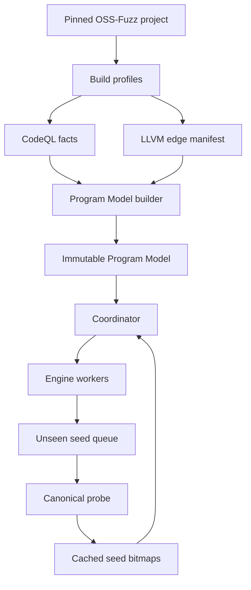

# Orchestra V2 design

## 1. Decision summary

Orchestra V2 is a side-by-side rewrite, not an in-place replacement of V1.
V1 remains the experiment-reproduction baseline. V2 may reuse process and
corpus-management experience through adapters, but its core data flow is new:

```text
pinned OSS-Fuzz build
  -> build-time CodeQL facts + LLVM runtime edge manifest
  -> immutable Program Model
  -> one-time canonical replay of unseen seeds
  -> cached coverage bitmaps
  -> incremental Coordinator state
  -> later Region/seed/fuzzer decisions
```

The first go/no-go question is whether this measurement chain is reliable:

```text
CodeQL guard
  -> LLVM true/false runtime edge IDs
  -> canonical seed bitmap
  -> Active Frontier transition
```

Region construction and scheduling policy must wait until this chain passes
the gates in `ROADMAP.md`.

## 2. Why V2 exists

### 2.1 Static analysis in V1 is expensive but underused

V1 primarily consumes Fuzz Introspector as a call-tree source. Much of its
richer output does not affect decisions, while enumerating root-to-leaf call
paths becomes expensive and gives Region an imprecise meaning on large targets.

### 2.2 Tree-sitter cannot support semantic claims

Tree-sitter is useful for syntax but cannot reliably determine:

- whether a predicate depends on fuzz input;
- whether a value came through a macro, enum, alias, or another function;
- the possible targets of indirect and virtual calls;
- which downstream blocks a guard controls;
- how a source predicate maps to a runtime branch.

V2 uses CodeQL facts extracted from the real build for source-level semantics.
It does not treat CodeQL as a runtime coverage system.

### 2.3 V1 online cost grows with historical corpus size

Replaying the entire corpus and rebuilding `llvm-cov` reports after each job
makes analysis cost grow with all seeds ever retained. V2 hashes and measures
only globally unseen seeds, caches their canonical coverage, and computes
unions and differences from bitmaps. Its incremental cost should depend mainly
on the number of new seeds in the job.

### 2.4 Contribution and Region semantics need to be explicit

Concurrent fuzzing requires separate measures for local job progress,
merge-time global novelty, and work duplicated by concurrent jobs. A Region
must be defined by an active frontier and its controlled graph, rather than by
a source interval or every root-to-leaf call path.

## 3. Goals and non-goals

### Goals

1. Build reproducible, versioned semantic and runtime facts.
2. Give coverage the same meaning across different fuzzing engines.
3. Make online analysis incremental in newly observed seeds.
4. Define frontier, Region, seed evidence, and job contribution precisely.
5. Make decisions replayable and suitable for ablation experiments.
6. Start with an interpretable scheduler only after measurement is validated.

### Non-goals

- Do not query CodeQL during fuzzing.
- Do not support every C/C++ construct or indirect call in the first slice.
- Do not claim static analysis proves a seed will enter a Region.
- Do not support every existing fuzzer in the first slice.
- Do not use CodeQL database IDs as persistent or runtime identifiers.
- Do not require all engines to share a binary or object cache.
- Do not add reinforcement learning before simple measurable policies work.

## 4. Architecture



### 4.1 Build layer

Orchestra uses OSS-Fuzz as a local build backend. It reuses the pinned upstream
`project.yaml`, `Dockerfile`, `build.sh`, harness, dictionaries, and runner
contract. It does not submit Orchestra itself as an OSS-Fuzz project.

CodeQL must observe the actual compiler processes. Therefore the CodeQL CLI is
mounted read-only into the project builder container and wraps
`/usr/local/bin/compile` there. Wrapping host-side `infra/helper.py` cannot see
compiler processes across the container boundary.

The intended profiles are:

| Profile | Output | Frequency |
|---|---|---:|
| `semantic-canonical` | DB, canonical binary, edges | per model |
| `engine-<name>` | engine target and runner metadata | per engine family |
| `report-coverage` | source coverage binary | evaluation only |
| `debug` | symbols and diagnostics | on demand |

The scaffold implements the first two profile shapes. `report-coverage` and
`debug` remain design requirements, not current commands.

The preferred optimization is one semantic-canonical build in which CodeQL
tracing and LLVM pass injection coexist. If compiler/extractor compatibility is
not reliable, split it into automatic `semantic` and `canonical` profiles that
still use the same upstream OSS-Fuzz project definition.

### 4.2 Build-time semantic layer

The QL pack exports facts, not policy. Its eventual minimum fact set is:

- functions, linkage, location, complexity, and harness reachability;
- direct and confidence-labelled indirect calls;
- `if`, loop, conditional-expression, and `switch` guards;
- raw predicate features, types, signedness, operators, and constants;
- local and selectively computed interprocedural input dependency;
- control dependence and candidate dictionary tokens.

Queries must not construct root-to-leaf Regions or scheduler scores. The model
builder in Go performs deterministic key generation, mapping, graph work, and
schema validation.

Input dependency classes are:

- `none` -- proven independent of fuzz input;
- `local_direct` -- direct local data flow;
- `interprocedural_modeled` -- interprocedural flow through modeled code;
- `interprocedural_unmodeled` -- flow crosses an unmodeled boundary;
- `unknown` -- analysis was inconclusive or exhausted its budget.

`unknown` is not equivalent to `none`.

### 4.3 LLVM runtime identity layer

CodeQL source entities do not provide runtime coverage IDs. The LLVM pass must
instrument conditional branch successors and emit, for every outcome:

- deterministic `edge_id` within a Program Model;
- function linkage/name;
- debug file, line, and column;
- inline stack;
- successor ordinal;
- normalized IR fingerprint.

A line number is never a sufficient mapping key. Macro expansion,
short-circuit conditions, templates, inlining, and optimization may create
multiple IR branches at one source location.

The model builder classifies matches as `exact`, `ambiguous`, `unmapped`, or
`unsupported`. Only `exact` mappings enter scheduling. A collision or uncertain
match is an explicit error or diagnostic, not an invitation to guess.

### 4.4 Canonical runtime measurement

Each fuzzer keeps its native execution and feedback instrumentation. A worker
reports only newly produced candidate seeds and job statistics. For each
`model_id + seed_hash` not already present:

1. hash and globally deduplicate the seed;
2. enqueue it for canonical replay;
3. run it against the stable-edge canonical binary;
4. record edge bitmap, status, execution cost, and crash signature;
5. persist the Seed Record before updating global state.

Persistent in-process replay is preferred. Forkserver or subprocess execution
is an explicit fallback for targets that cannot reset safely. Backlog and
`replay_cpu_time / fuzz_cpu_time` are measured. If the queue exceeds its bound,
apply backpressure rather than silently discarding seeds and continuing to
compute biased capability scores.

### 4.5 Online coordination

The Coordinator consumes only:

- one immutable Program Model;
- cached canonical Seed Records;
- versioned job messages;
- append-only events and current derived state.

It never parses source, queries CodeQL, compares engine-native coverage maps,
or reruns the historical corpus. `program_model.sqlite` is read-only;
`campaign.sqlite` stores campaign state in WAL mode; an append-only event log
must be sufficient to replay derived decisions.

The exact coverage formulas and authority rules are in `CONTRACTS.md`.

## 5. Active Frontier and Region

For an exactly mapped binary guard `g`:

```text
evaluated(g) = covered(true_edge) OR covered(false_edge)
partial(g)   = covered(true_edge) XOR covered(false_edge)
```

It is an Active Frontier only when:

1. mapping is `exact`;
2. exactly one successor is covered;
3. input dependency is neither `none` nor `unknown` for the first slice;
4. uncovered code remains downstream of the uncovered successor;
5. no evidence has retired it as unreachable or persistently invalid.

The first slice supports binary branches. Multi-way `switch` frontiers are a
later extension.

A Region is not a root-to-leaf path. Its intended definition is:

```text
R = <Frontier F, bounded call context C, controlled subgraph G>
```

- `F` is one or a small related set of active frontiers.
- `C` retains at most the last K call-context levels and relevant dispatches.
- `G` is the uncovered-successor-controlled graph after SCC compression.

Static call/control facts may over-approximate; cached dynamic function and
edge coverage trim the candidate graph. Only active-frontier-related Regions
are materialized.

## 6. Later seed and scheduling policy

This section is a design target, not current implementation.

Seed selection uses cached bitmaps to measure arrival at the covered side of a
frontier, overlap with Region context, execution cost, size, prior novelty, and
coverage diversity. It may improve the probability of reaching a Region; it
must not be described as a guarantee.

Predicate facts remain a raw feature vector. Candidate tokens may come from
integer/string constants, comparisons, enums, bit masks, ranges, and relevant
library-call arguments. Engine adapters translate them to native dictionary
formats.

Capability observations retain evidence rather than one opaque score:

```text
fuzzer, predicate features, attempted/crossed frontiers,
job/novel edges, CPU seconds, executions, replay overhead
```

The first scheduler should be a versioned, explainable linear or bandit policy
with exploration and restart/backlog costs. Every raw component and RNG seed is
logged so the decision can be replayed and ablated.

## 7. Reproducibility requirements

A Program Model and its artifacts must identify at least:

- OSS-Fuzz commit and project-definition hash;
- target source commit/tree hash and fuzz target;
- Docker image digest;
- build profile, architecture, engine, sanitizer, compiler and flags;
- binary hash;
- CodeQL bundle and QL pack version;
- LLVM pass and schema version;
- Program Model ID.

The current manifest does not yet contain every field above; that is an open
M0/M1 task, not permission to omit the requirement.

Do not redistribute the CodeQL CLI. Document its pinned version and mount an
external installation read-only.

## 8. Risks and required fallbacks

| Risk | Evidence | Fallback |
|---|---|---|
| no CodeQL capture | TU count and log | explicit compile mode |
| costly global flow | time and peak memory | candidate-only analysis |
| uncertain calls | targets and confidence | unknown plus dynamic trimming |
| weak source/IR map | mapping rates | narrow scope or IR-first |
| replay overload | backlog and CPU ratio | deduplication and backpressure |
| Region explosion | counts and SCC sizes | SCC/K-context limits |
| build drift | fingerprints and CI | pinned, explicit upgrades |
| combined-build conflict | fact completeness | split automatic profiles |

## 9. Final system acceptance

V2 is ready for paper-scale experiments only when:

1. targets build through pinned OSS-Fuzz definitions without V2 per-target
   build scripts;
2. every artifact and Program Model has an immutable provenance fingerprint;
3. CodeQL is offline-only;
4. scheduled frontiers have exact static/runtime mappings;
5. an unseen seed is replayed at most once per model;
6. per-job analysis cost scales with new seeds rather than all historical
   seeds;
7. Region semantics and stop conditions are algorithmically specified;
8. concurrent local, novel, and duplicate contributions are separable;
9. decisions replay from Program Model, Seed Records, events, and RNG seed;
10. experiments include modern single-fuzzer, equal-budget coordination, and
    shared-corpus-without-scheduling baselines;
11. ablations, repeated trials, confidence intervals, effect sizes, and
    overhead are reported.

Milestone-level gates and the current branch state are maintained in
`ROADMAP.md`.
