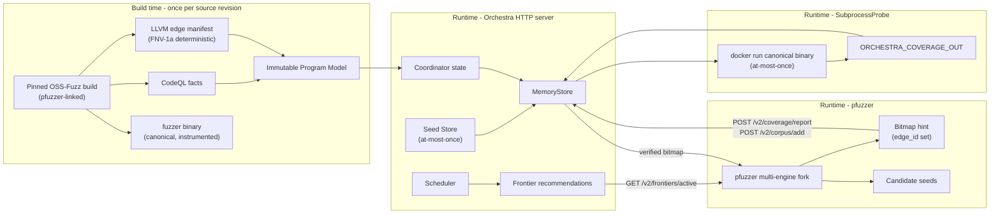

# Orchestra V2

Orchestra V2 is developed beside the existing implementation. V1 remains the
reproduction baseline; V2 packages do not import `internal/analysis` or the V1
plugin graph.

## Start here

This README is the short operational entry point. Coding agents and new
contributors must also read:

1. [`DESIGN.md`](DESIGN.md) -- motivation, authoritative architecture, goals,
   non-goals, and final acceptance conditions.
2. [`CONTRACTS.md`](CONTRACTS.md) -- identity, Program Model, seed, job,
   frontier, Region, and event semantics.
3. [`ROADMAP.md`](ROADMAP.md) -- actual component status, milestone gates, and
   the ordered handoff work queue.
4. [`../../AGENTS.md`](../../AGENTS.md) -- repository rules and required
   verification for coding agents.

The current branch is a V2 scaffold that has been extended through M0–M5
and is mid-refactor for the passive-analyzer architecture (turn 12). All 21
OSS-Fuzz targets have been adapted and verified (BUILD + SMOKE); the HTTP API
(`/v2/*`), trust boundary, and pfuzzer linkage are pending implementation.
`ROADMAP.md` is authoritative when a source file or interface makes a
component look more complete than it is.

## Implemented in this scaffold

- A versioned target manifest with pinned OSS-Fuzz and source revisions
  (21 targets).
- A generic OSS-Fuzz build adapter; no V2 target-specific build scripts.
- Pfuzzer linkage: every built binary is linked against prebuilt pfuzzer
  `libFuzzer.a` (not upstream libFuzzer); supports both
  `./binary /seed` (libFuzzer replay) and
  `./binary -fork=N -fuzzers=afl,libfuzzer /corpus` (multi-engine fork).
- CodeQL compiler tracing inside the builder container around
  `/usr/local/bin/compile`.
- Separate semantic/canonical and engine build profiles.
- Content hashes and an artifact manifest for every completed profile.
- Initial CodeQL fact queries for functions, direct calls, and `if` guards.
- Program Model and Campaign SQLite schemas.
- Versioned worker/coordinator JSON contracts.
- A deterministic coordinator state machine that distinguishes local job
  progress, merge-time novelty, and concurrent duplication.
- An Active Frontier evaluator that schedules only exact runtime mappings.
- An HTTP API exposing V1 (`/v1/*`, deprecated) and V2 (`/v2/*`, current)
  endpoints for pfuzzer integration.
- A canonical replay probe (Docker exec against the canonical binary) with
  at-most-once caching in `MemoryStore`.
- ModelAwareState deriving coverage unions and frontier transitions from
  persisted Seed Records (not caller-provided bitmaps).
- A linear-policy scheduler with capability observation and RNG-seed
  determinism.

## Deliberately not implemented yet

- The HTTP `/v2/*` endpoint handlers (server skeleton exists in V1
  contract; V2-specific handlers pending T5.1).
- The trust boundary: pfuzzer bitmap override via SubprocessProbe (T5.2).
- The pfuzzer-side HTTP client (`pfuzzer/FuzzerOrchestra.cpp`, T5.4).
- Dictionary mining against `frontier_tokens` table (real implementation,
  not just the current placeholder).
- M8: empirical performance validation of the V2 performance contract.
- M9: column-disambiguated mapping for ≥ 90% exact rate.
- M10: paper-scale evaluation.

These are later milestones. Adding the HTTP API and trust boundary before
the measurement chain is validated would make results difficult to trust.

## Build flow



CodeQL must see the actual compiler processes. For that reason it is mounted
into the OSS-Fuzz builder and wraps `compile` inside the container. Wrapping the
host-side `infra/helper.py` process would not observe compiler processes across
the Docker boundary.

The entrypoint invokes the CodeQL plumbing sequence `database init`,
`trace-command`, and `finalize` explicitly. This publishes the in-progress
database metadata before the traced OSS-Fuzz compile command runs.

The entrypoint checks out the configured source revision before compiling. It
refuses to overwrite an existing CodeQL database, so stale extraction data
cannot be silently mixed into a new model.

## Local setup

The checked-in example pins exact revisions. Prepare the external tools without
adding them to Git:

```bash
git clone https://github.com/google/oss-fuzz.git third_party/oss-fuzz
git -C third_party/oss-fuzz checkout d3eb91008ac102440b4a47b268f6f3de3f29cd14
git clone https://github.com/grubwithu/pfuzzer.git third_party/pfuzzer
```

Download a matching CodeQL bundle and extract it under `tools/codeql`. Do not
commit or redistribute the CodeQL CLI.

Validate and inspect the build plan before running Docker:

```bash
go run ./cmd/orchestra-ossfuzz validate -config experiments/targets.yaml

go run ./cmd/orchestra-ossfuzz plan \
  -config experiments/targets.yaml \
  -target zlib-uncompress \
  -profiles semantic-canonical,engine-libfuzzer
```

Build the pfuzzer prebuilt library (one-time):

```bash
go run ./cmd/orchestra-pfuzzer-build
```

Execute the selected profiles:

```bash
go run ./cmd/orchestra-ossfuzz build \
  -config experiments/targets.yaml \
  -target zlib-uncompress \
  -profiles semantic-canonical,engine-libfuzzer
```

Every profile writes its binary, work directory, and `manifest.json` beneath
`build/v2/artifacts/<target>/<profile>`.

## HTTP API surface (V2)

Orchestra exposes a versioned HTTP API. `/v1/*` is the deprecated V1 surface
(retained for one release cycle); `/v2/*` is the current surface pfuzzer V2
client uses.

### V1 endpoints (deprecated, retained one release cycle)

| Endpoint | Method | Purpose |
|---|---|---|
| `GET /healthz` | GET | Liveness check |
| `GET /v1/state` | GET | Current state version and global edge set |
| `POST /v1/jobs/dispatch` | POST | Capture the global-coverage dispatch snapshot |
| `POST /v1/jobs/complete` | POST | Merge a job and return the three coverage deltas |

### V2 endpoints (current, pfuzzer-driven)

| Endpoint | Method | Purpose |
|---|---|---|
| `GET /v2/health` | GET | Liveness + API version |
| `GET /v2/state` | GET | `model_id`, frontier_count, active_count, coverage_size |
| `GET /v2/frontiers/active` | GET | Priority-ordered active frontiers + per-frontier recommended seeds + dictionary tokens |
| `POST /v2/corpus/add` | POST | pfuzzer reports new candidate seed; Orchestra verifies via SubprocessProbe |
| `POST /v2/coverage/report` | POST | pfuzzer reports bitmap observation; Orchestra updates capability_observations |
| `GET /v2/dictionary` | GET | Full corpus dictionary from Program Model |

The HTTP server is a passive analyzer, not a fuzzer driver: pfuzzer remains the
engine execution host and calls these endpoints via
`pfuzzer/FuzzerOrchestra.cpp` for guidance.

## Safety and reproducibility invariants

1. Mutable revisions such as `master`, `main`, and `HEAD` fail validation.
2. Target and profile names are validated before becoming command arguments or
   filesystem paths.
3. Commands are executed with argument arrays, not through a shell.
4. Source checkout happens inside an ephemeral builder container.
5. CodeQL databases are never overwritten implicitly.
6. Ambiguous/unmapped frontiers remain observable but are not schedulable.
7. A build manifest records both declared inputs and discovered artifact hashes.
8. Project-image builds are non-interactive and use cached base images; refreshing
   an OSS-Fuzz base image is an explicit operation that requires fresh evidence.
9. Every fuzzer binary is linked against prebuilt pfuzzer `libFuzzer.a` (not
   upstream libFuzzer), so multi-engine coordination is preserved.

## Next implementation milestone

The next hard target is the passive-analyzer refactor (T5):

```text
pfuzzer multi-engine fork
  -> POST /v2/state            (sync model + state version)
  -> GET  /v2/frontiers/active (recommended frontiers + seeds)
  -> POST /v2/corpus/add      (new seed bitmap hint)
     |
     v
Orchestra HTTP server
  -> SubprocessProbe.Measure   (verify against canonical binary)
  -> MemoryStore.Put           (at-most-once, verified bitmap)
  -> Coordinator state update  (job_delta, novel_delta, concurrent_duplicate)
  -> Scheduler.RecommendFrontiers
     |
     v
  -> POST /v2/frontiers/active response (next round of recommendations)
  -> POST /v2/coverage/report response (acknowledged, capability recorded)
```

The milestone passes when:

1. pfuzzer actually drives multi-engine campaigns against the V2 server on
   all 21 OSS-Fuzz targets (M7 verification).
2. Bitmap union is empirically O(K), not O(N²) (M8 validation).
3. Frontier evaluation is empirically O(1) (M8 validation).
4. HTTP `/v2/*` recommendations drive real fuzzing improvement vs. random
   baseline (M7 validation).

Before implementing the refactor, finish M0: execute the pinned
`zlib-uncompress` semantic-canonical build, verify the target with the matching
OSS-Fuzz base runner, inspect the captured CodeQL database, validate the
artifact manifest, and record reproducibility evidence. See the ordered tasks
in [`ROADMAP.md`](ROADMAP.md).
