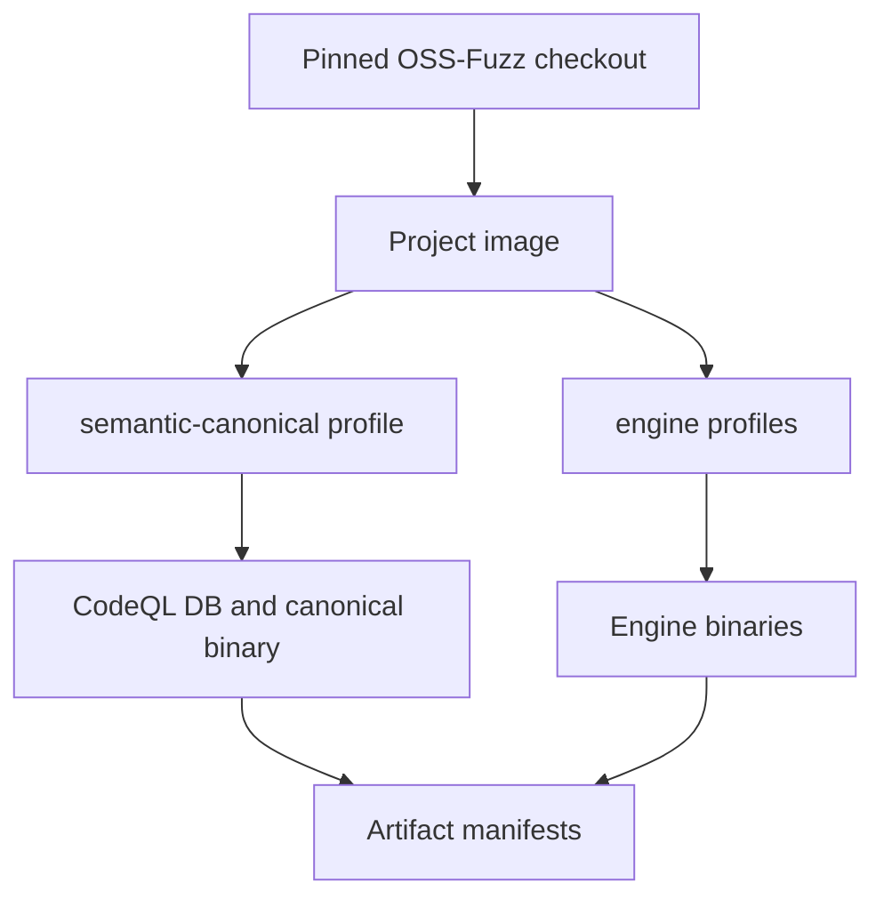

# Orchestra V2 scaffold

Orchestra V2 is developed beside the existing implementation. V1 remains the
reproduction baseline; V2 packages do not import `internal/analysis` or the V1
plugin graph.

## Implemented in this scaffold

- A versioned target manifest with pinned OSS-Fuzz and source revisions.
- A generic OSS-Fuzz build adapter; no V2 target-specific build scripts.
- CodeQL compiler tracing inside the builder container around
  `/usr/local/bin/compile`.
- Separate semantic/canonical and engine build profiles.
- Content hashes and an artifact manifest for every completed profile.
- Initial CodeQL fact queries for functions, direct calls, and `if` guards.
- Program Model and Campaign SQLite schemas.
- Versioned worker/coordinator JSON contracts.
- A deterministic coordinator state machine that distinguishes local job
  progress, merge-time novelty, and concurrent duplication.
- An Active Frontier evaluator that schedules only exact runtime mappings.
- A small HTTP API for exercising the dispatch/merge vertical slice.

## Deliberately not implemented yet

- The LLVM stable-edge-ID pass and source-to-IR mapper.
- The CodeQL-result-to-`program_model.sqlite` importer.
- Persistent canonical replay and compressed bitmap storage.
- Production fuzzer adapters and corpus watchers.
- Region construction, capability learning, and scheduling policy.

These are later milestones. Adding policy before the measurement chain is
validated would make results difficult to trust.

## Build flow



CodeQL must see the actual compiler processes. For that reason it is mounted
into the OSS-Fuzz builder and wraps `compile` inside the container. Wrapping the
host-side `infra/helper.py` process would not observe compiler processes across
the Docker boundary.

The entrypoint checks out the configured source revision before compiling. It
refuses to overwrite an existing CodeQL database, so stale extraction data
cannot be silently mixed into a new model.

## Local setup

The checked-in example pins exact revisions. Prepare the external tools without
adding them to Git:

```bash
git clone https://github.com/google/oss-fuzz.git third_party/oss-fuzz
git -C third_party/oss-fuzz checkout d3eb91008ac102440b4a47b268f6f3de3f29cd14
```

Download a matching CodeQL bundle and extract it under `tools/codeql`. Do not
commit or redistribute the CodeQL CLI.

Validate and inspect the build plan before running Docker:

```bash
go run ./cmd/orchestra-ossfuzz validate -config experiments/targets.yaml

go run ./cmd/orchestra-ossfuzz plan \
  -config experiments/targets.yaml \
  -target zlib-uncompress \
  -profiles semantic-canonical,engine-libfuzzer
```

Execute the selected profiles:

```bash
go run ./cmd/orchestra-ossfuzz build \
  -config experiments/targets.yaml \
  -target zlib-uncompress \
  -profiles semantic-canonical,engine-libfuzzer
```

Every profile writes its binary, work directory, and `manifest.json` beneath
`build/v2/artifacts/<target>/<profile>`.

## Coordinator vertical slice

Start the in-memory coordinator:

```bash
go run ./cmd/orchestra-coordinator \
  -model-id example-model \
  -listen 127.0.0.1:8081
```

Endpoints:

| Endpoint | Purpose |
|---|---|
| `GET /healthz` | Liveness check |
| `GET /v1/state` | Current state version and global edge set |
| `POST /v1/jobs/dispatch` | Capture the global-coverage dispatch snapshot |
| `POST /v1/jobs/complete` | Merge a job and return the three coverage deltas |

The HTTP server is a contract harness, not the final persistent coordinator.
Campaign SQLite, the append-only event log, authentication, and recovery are
the next persistence milestone.

## Safety and reproducibility invariants

1. Mutable revisions such as `master`, `main`, and `HEAD` fail validation.
2. Target and profile names are validated before becoming command arguments or
   filesystem paths.
3. Commands are executed with argument arrays, not through a shell.
4. Source checkout happens inside an ephemeral builder container.
5. CodeQL databases are never overwritten implicitly.
6. Ambiguous/unmapped frontiers remain observable but are not schedulable.
7. A build manifest records both declared inputs and discovered artifact hashes.

## Next implementation milestone

Use the zlib target to complete this chain before adding another project:

```text
CodeQL guard
  -> LLVM true/false edge manifest
  -> exact mapping status
  -> canonical replay bitmap
  -> Active Frontier transition
  -> coordinator job feedback
```

The milestone passes only when manually labeled guards meet the mapping-quality
threshold and the incremental bitmap result matches a full-corpus replay.
